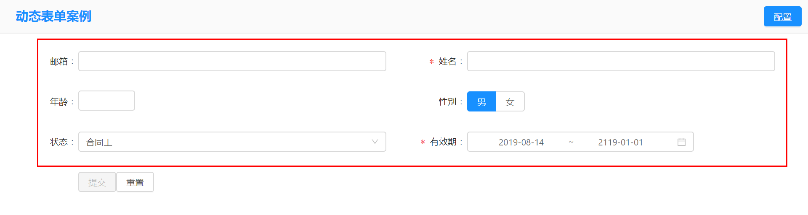

# <!--fit-->自定义表单实现方法探讨
@Mars zheng
2019/8/14

---

# 动态表单中应该包含的功能
* 可以动态添加项目进行编辑
* 项目的类型可以多种形态：文本框，选择框，checkbox等等。
* 各个项目可以实现分列布局
* 各个项目可以手动排序，改变位置

---

# @delon/form 动态表单能够做什么
* 使用Json数据生成表单
* 支持ng-zorro的大部分控件。
* 支持自定义控件

---

# 关键问题
使用@delon/form，已经有了实现大部分功能的基础了，
只需在理解@delon/form的基础上，灵活运用。
唯一需要重点考虑的是，如果实现手动排序。

```
? ? 大家可以先想一想。
```

---

# 思路
手动排序的前提是，有个数组数据。
所以，如果要生成一个能够排序的动态表单，关键是如何
将数组数据转成符合 @delon/form 规范的json数据。

---
# @delon/form 的Json数据
```typescript
schema: SFSchema = {
    properties: {
      email: {
        type: 'string',
        title: '邮箱',
        format: 'email',
      },
      name: {
        type: 'string',
        title: '姓名',
        minLength: 10
      },
      age: {
        type: 'number',
        title: '年龄',
        minLength: 3
      },
      gender: {
        type: 'string',
        title: '性别',
        enum: ['男', '女'],
        ui: {
          widget: 'radio',
          styleType: 'button',
          buttonStyle: 'solid',
        } as SFRadioWidgetSchema,
        default: '男',
      },
```
---
```typescript
 status: {
        type: 'string',
        title: '状态',
        enum: [
          { label: '合同工', value: 'WAIT_BUYER_PAY' },
          { label: '临时工', value: 'TRADE_SUCCESS' },
          { label: '实习生', value: 'TRADE_FINISHED' },
        ],
        default: 'WAIT_BUYER_PAY',
        ui: {
          widget: 'select',
        } as SFSelectWidgetSchema,
      },
      start: {
        type: 'string',
        title: '有效期',
        ui: { widget: 'date', end: 'end' } as SFDateWidgetSchema,
        default: new Date(),
      },
      end: {
        type: 'string',
        default: '2119-1-1',
      },

    },
    required: ['name', 'start' ] ,
    ui: {
      spanLabelFixed: 100,
      grid: {
        span: 12
      }
    }
  };
```
---
# 效果



---
# Json数据的说明
参考： https://ng-alain.com/form/getting-started/zh

---
# 如何生成这个JSON数据
1. 设计一个表单配置画面，用来配置JOSN需要的各项数据。
2. 将配置画面的数据，使用数组的方式保存，以实现拖动改变位置。
    * 将各种类型的控件封装成不同的类。
3. 能将数组的数据转换成json。

---
# 代码
代码放在git上。
https://github.com/gassyou/DynamicForm

---
# 目前的成果
1. 页面可以达到动态配置，而且可以拖动改变位置。
2. 只是一个框架性的思路。很多细节可以更加完善。
3. 这个只是解法之一，大家可以一起想一想其他的解决方案。

---

# 如果需要实现类似sw的效果，还需要做的工作
1. 数据的保存。
    * 保存成json数据格式
    * 分系统数据库和业务数据库保存数据。
2. 如果各个自定义字段中有业务联系，如果，将业务逻辑体现上去
    * 依赖注入
3. JSON数据结构还和往更深处发掘。
    * 配置画面的功能可以更加强大。

```
插件化开发
https://zhuanlan.zhihu.com/p/76379031
```

